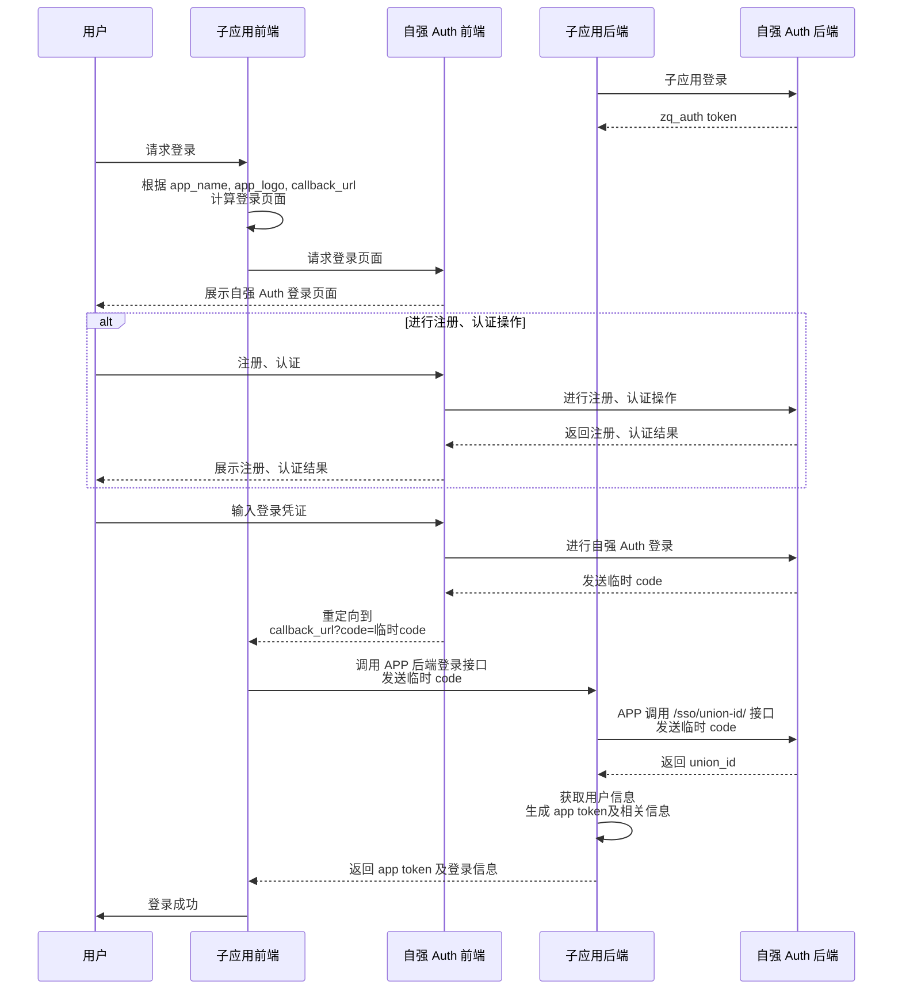

# 什么是自强 Auth

自强 Auth 是一个基于学生信息的统一认证服务，旨在为第三方应用（下称`子应用`）提供便捷的学生统一认证服务。

## Motivation

在自强项目开发中，每个子应用都要准备一套用户注册登录接口、用户信息更新接口，用户在使用每个自强应用时都需要重新注册，填写个人信息。若应用需要进行学生身份认证，用户还需要多次进行认证操作。

为了简化后端开发以及提升用户体验，我们仿照[微信小程序用户认证](https://developers.weixin.qq.com/miniprogram/dev/framework/open-ability/login.html)
以及[武大 CAS 登录服务](https://cas.whu.edu.cn/)制作了`自强 Auth` 统一认证服务平台：

- 为后端提供统一登录接口，统一用户标识，以及用户必要身份信息
- 为用户提供统一登录界面及账户，一个账户登录多个应用，一次认证享受多个应用服务

## 术语

为了方便理解，我们在这里定义一些术语：

### 应用

- 自强 Auth：统一认证服务平台，本项目
- 子应用：使用`自强 Auth`服务的应用，例如`招新小程序`、`赛道友你`等
- App Name：`子应用标识`，即`子应用`的英文名，例如 `zq_recruitment`, `zq_teamup` 等
- App Key：`子应用`在`自强 Auth`平台的唯一标识，由`自强 Auth`平台生成（类似于登录用户名）
- App Secret：`子应用`在`自强 Auth`平台的密钥，由`自强 Auth`平台生成（类似于登录密码）
- App Logo：`子应用`在`自强 Auth`平台的图标，用于在`自强 Auth`平台展示
- Zq_Auth Token：jwt token，`子应用`在`自强 Auth`平台的访问令牌，用于`子应用`访问`自强 Auth`平台的接口
- APP Token：jwt token，`子应用`自身的访问令牌，用于`子应用`前端访问自身后端的接口

### 用户

- `用户`：使用`自强 Auth`服务的用户，即`子应用`的用户
- `用户信息`：`用户`在`自强 Auth`平台中登记的个人信息，包括`姓名`、`学号`、`手机号`、`是否通过学生认证`等
- `UnionId`：`用户`在`自强 Auth`平台的唯一标识，格式为不含 `-` 的 `UUID` 字符串，子应用需要保存`UnionId`，以便后续获取用户信息
- `Code`：`用户`在`自强 Auth`平台的临时登录凭证，有效期为 5 分钟，子应用凭借 `Code` 获取`UnionId`

## 服务流程

